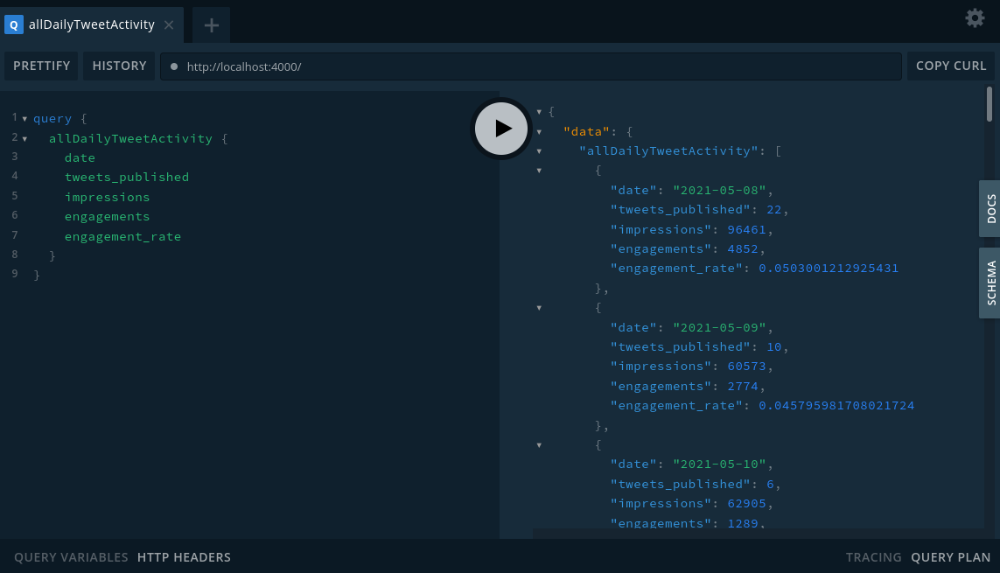

# GraphQL Hello World

This template provides a basic GraphQL API and unit testing.

## Example



## Getting started

### 1. install dependencies

```
cd graphql-api-template
npm install
```

### 2. Run unit tests

```
npm run test
```

### 3. Launch the GraphQL Playground

```
npm run dev
```
